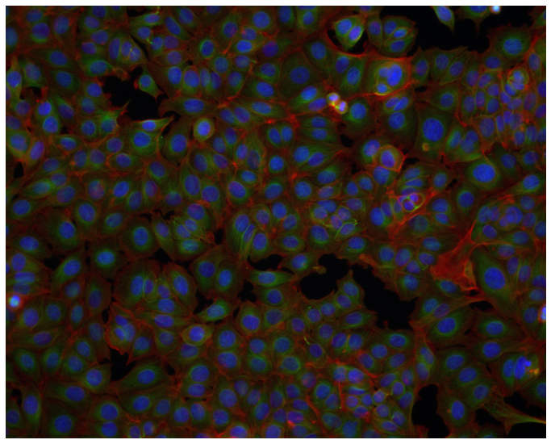
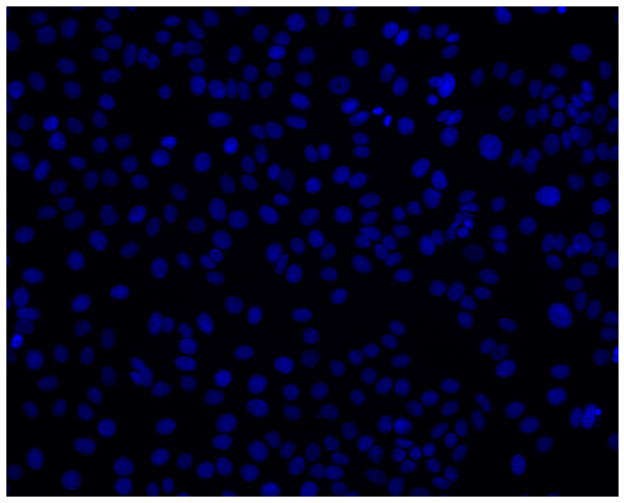

<p align="center">
    
    
     
    
</p>

# pybbbc
This is a python interface to the BBBC021 dataset of cellular images ([Caie et al., Molecular Cancer Therapeutics, 2010](http://dx.doi.org/10.1158/1535-7163.MCT-09-1148)), available from the Broad Bioimage Benchmark Collection ([Ljosa et al., Nature Methods, 2012](http://dx.doi.org/10.1038/nmeth.2083)).

The dataset is made of 13,200 fields of view imaged in three channels of resolution 1024x1280 and the corresponding metadata: site, well, replicate, plate, compound, concentration and mechanism of action (MoA).

The images are of MCF-7 breast cancer cells treated for 24 h with a collection of 113 small molecules at eight concentrations. The cells were fixed, labeled for DNA, F-actin, and Β-tubulin, and imaged by fluorescent microscopy. The complete description of the dataset can be found [here](https://bbbc.broadinstitute.org/BBBC021).

## Usage
An instance of the dataset can be easily created with the following code:
```python
from pybbbc import BBBC021

bbbc021 = BBBC021()
```
### Indexing
Standard indexing (i.e. ```bbbc021[3]``` or ```bbbc021[2:5]```) can be used to access samples and subsets. A single sample is a tuple ```(image, metadata)``` where the metadata is a tuple itself of plate metadata and compound metadata using the following structure:
```python
metadata = (
    ( # plate metadata
        site,
        well,
        replicate,
        plate
    ), 
    ( # compound metadata
        compound,
        concentration,
        moa
    )
)
```


### Filtering
The instance of a dataset can be intuitively filtered during the initiation using metadata keyword arguments as follows:
```python
# get the samples without MoA
bbbc021 = BBBC021(moa='null')
```
or using a list of metadata values:
```python
# get the samples with the colchicine and latrunculin B compounds
bbbc021 = BBBC021(compound=['colchicine', 'latrunculin B'])

# get the samples with only a selection of Mechanisms of Action
bbbc021 = BBBC021(moa=['Actin disruptors', 'DMSO', 'Microtubule destabilizers'])
```
The dataset can be filtered using any metadata keyword: ```site```, ```well```, ```replicate```, ```plate```, ```compound```, ```concentration``` and ```moa```. The unique values of the most relevant keywords are stored as static attributes: ```BBBC021.PLATES```, ```BBBC021.COMPOUNDS``` and ```BBBC021.MOA```. Other useful static attributes are ```BBBC021.IMG_SHAPE```, ```BBBC021.CHANNELS``` and ```BBBC021.N_SITES```.

### Sub-datasets
The individual sub-datasets and their corresponding samples can be accessed as well after initiation:
```python
bbbc021 = BBBC021()

img = bbbc021.images[0]

# bbbc021.wells
# bbbc021.sites
# bbbc021.replicates
# bbbc021.plates
# bbbc021.compounds
# bbbc021.concentrations
# bbbc021.moa
```

## Data download
The raw data can be downloaded after importing the BBBC021 dataset as follows:
```python
from pybbbc import BBBC021

BBBC021.download()
```
This will automatically create the data folder in the current working directory and download images and metadata (this may take several hours). Alternatively, it is possible to specify the ```data_path``` parameter to set the destination folder.

## Dataset creation
After downloading the raw data, the preprocessed dataset can be created by calling the static method ```make_dataset()```.
```python
from pybbbc import BBBC021

# BBBC021.download()
BBBC021.make_dataset()
```
This function will execute the following steps:
* Merge the metadata regarding the compound and the Mechanism of Action (MoA)
* Compute and apply the illumination correction function to the images
* Scale pixel intensities in the \[0, 1\] range discarding the top and bottom 0.1 percentiles
* Create a virtual HDFS dataset (using h5py) associating the images to the corresponding metadata

### Illumination correction
In order to compute the illumination correction function an image is created, consisting of the average of all the images taken at the same site and belonging to the same plate. This image is then smoothed using a Gaussian filter with sigma=500. A robust minimum is calculated as the 0.02 percentile of all the positive values of the average image, and all the pixel with smaller values are truncated. This image is finally divided by the robust minimum in order to have only values greater or equal to one so that the illumination correction can be applied by dividing the original image by the illumination function.

```python
def correct_illumination(images, sigma=500, min_percentile=0.02):
    img_avg = images.mean(axis=0)
    img_mask = gaussian_filter(img_avg, sigma=sigma)
    robust_min = np.percentile(img_mask[img_mask > 0], min_percentile)
    img_mask[img_mask < robust_min] = robust_min
    img_mask = img_mask / robust_min
    return images / img_mask
```
